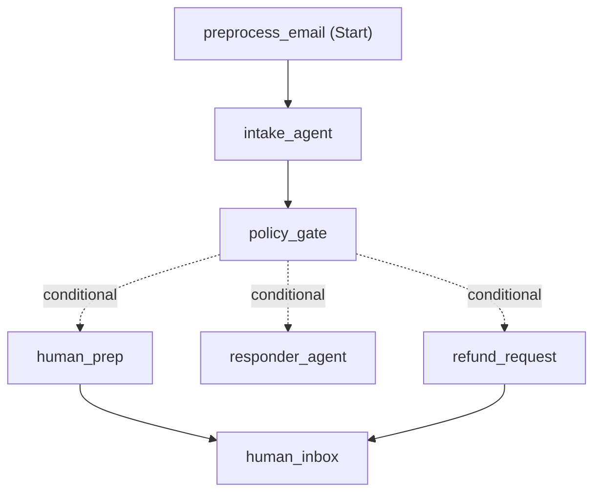

```mermaid
flowchart TD
  preprocess_email["preprocess_email (Start)"]
  intake_agent["intake_agent"]
  policy_gate["policy_gate"]
  human_prep["human_prep"]
  human_inbox["human_inbox"]
  responder_agent["responder_agent"]
  refund_request["refund_request"]

  preprocess_email --> intake_agent
  intake_agent --> policy_gate
  policy_gate -.->|conditional| human_prep
  policy_gate -.->|conditional| responder_agent
  policy_gate -.->|conditional| refund_request
  human_prep --> human_inbox
  refund_request --> human_inbox
```