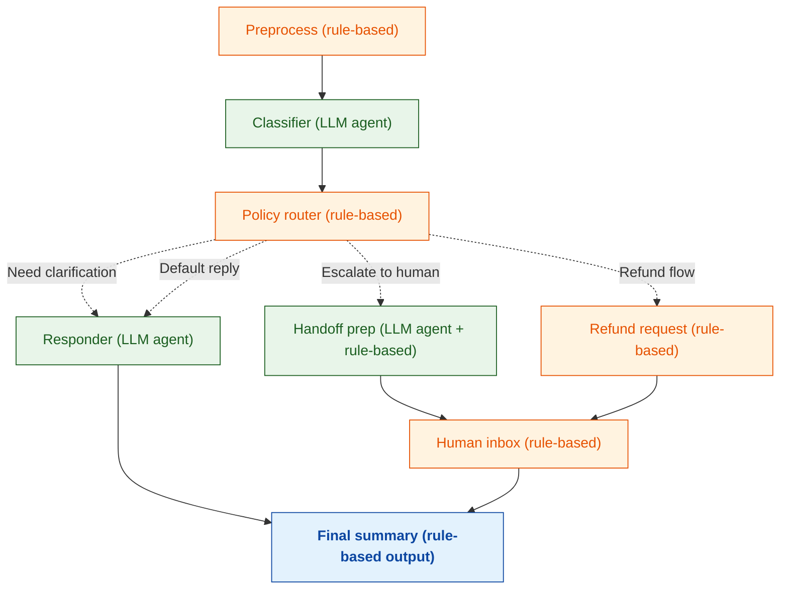

```mermaid
flowchart TD
  preprocess_email["Preprocess (rule-based)"]
  intake_agent["Classifier (LLM agent)"]
  policy_gate["Policy router (rule-based)"]
  responder_agent["Responder (LLM agent)"]
  human_prep["Handoff prep (LLM agent + rule-based)"]
  refund_request["Refund request (rule-based)"]
  human_inbox["Human inbox (rule-based)"]
  final_summary["Final summary (rule-based output)"]

  preprocess_email --> intake_agent
  intake_agent --> policy_gate

  policy_gate -.->|Escalate to human| human_prep
  policy_gate -.->|Need clarification| responder_agent
  policy_gate -.->|Refund flow| refund_request
  policy_gate -.->|Default reply| responder_agent

  human_prep --> human_inbox
  refund_request --> human_inbox
  responder_agent --> final_summary
  human_inbox --> final_summary

  classDef agent fill:#e8f5e9,stroke:#1b5e20,color:#1b5e20;
  classDef rules fill:#fff3e0,stroke:#e65100,color:#e65100;
  classDef output fill:#e3f2fd,stroke:#0d47a1,color:#0d47a1,font-weight:bold;

  class intake_agent,responder_agent,human_prep agent;
  class preprocess_email,policy_gate,refund_request,human_inbox rules;
  class final_summary output;
```
