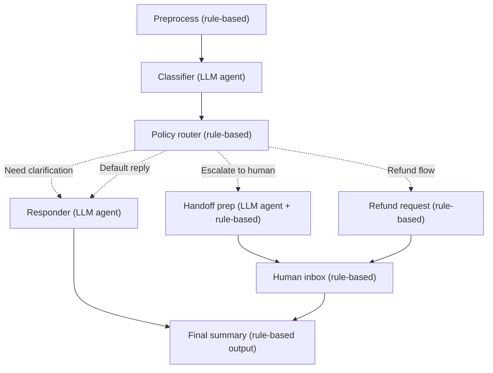

# Building Multi-Step Workflows with Agent Framework

In the [previous article](./article-1-agent-framework-basics.md), we explored how to build individual AI agents with Microsoft Agent Framework — agents that can call functions, extract structured data, and leverage RAG. These are powerful building blocks, but real-world scenarios often require something more: orchestrating multiple agents and deterministic logic into complex, multi-step processes.

That's where Agent Framework's workflow system comes in.

Think about a customer support email system. A single agent can't handle everything. You need to preprocess the email, classify it, apply business rules, route it appropriately, draft responses, and sometimes escalate to humans. Each step has different requirements — some need AI reasoning, others need deterministic logic, and all need to work together seamlessly.

In this guide, we'll build exactly that: a customer support email triage workflow that combines LLM agents with business logic to automatically process, classify, and respond to customer emails.

## What Are Workflows?

Workflows in Agent Framework are graph-based orchestration systems. Instead of writing monolithic code that tries to handle every scenario, you build a directed graph where:

- **Executors** are individual processing units (agents or custom logic)
- **Edges** connect executors and define the flow of data
- **Conditions** on edges enable dynamic routing based on context

This architecture gives you:

- **Modularity**: Each executor focuses on one task
- **Clarity**: The graph structure makes the process flow explicit
- **Flexibility**: Conditional edges adapt to different scenarios
- **Maintainability**: Changes to one step don't cascade through the entire system

For more on workflows, see the [Agent Framework Workflows Guide](https://learn.microsoft.com/en-us/dotnet/ai/agent-framework-workflows).

## The Use Case: Customer Support Email Triage

Let's define our business problem. We receive hundreds of customer support emails daily. We want to:

1. **Automatically process** routine requests
2. **Apply business rules** consistently
3. **Escalate appropriately** when human judgment is needed
4. **Maintain compliance** with data protection and policies

Here's the workflow we'll build:



The workflow handles four routing scenarios:

- **High-priority escalations**: Negative sentiment + high urgency → human handoff
- **Clarification needed**: Missing information → agent drafts questions
- **Refund requests**: Automated refund creation → human review
- **Normal replies**: Standard responses → agent drafts reply

## Workflow Architecture: The Building Blocks

Before diving into code, let's understand the three core concepts.

### Executors

An executor is a processing unit that takes an input, performs some operation, and returns an output. Every executor inherits from `Executor<TInput, TOutput>`:

```csharp
internal sealed class PreprocessEmailExecutor : Executor<string, EmailDocument>
{
    public override async ValueTask<EmailDocument> HandleAsync(
        string message,
        IWorkflowContext context,
        CancellationToken cancellationToken = default)
    {
        // Process the raw email...
        return processedEmail;
    }
}
```

Executors can be:

- **Deterministic**: Pure logic, no AI (preprocessing, routing, validation)
- **Agentic**: Uses LLM for reasoning (classification, response drafting)

### Edges

Edges connect executors and can include conditions for dynamic routing:

```csharp
var workflow = new WorkflowBuilder(startExecutor)
    .AddEdge(preprocess, intake)  // Simple edge
    .AddEdge<PolicyContext>(      // Conditional edge
        source: policyGate,
        target: responder,
        condition: ctx => ctx.Policy.Mode == ResponseMode.DraftReply)
    .Build();
```

Conditions let you build branching logic: "If sentiment is negative AND urgency is high, escalate to human."

### Shared State

Executors can communicate through shared state. This is crucial when multiple executors need access to the same data:

```csharp
// Write to shared state
await context.QueueStateUpdateAsync(
    SupportRunState.KeyEmail,
    email,
    scopeName: SupportRunState.ScopeName
);

// Read from shared state
var email = await context.ReadStateAsync<EmailDocument>(
    SupportRunState.KeyEmail,
    scopeName: SupportRunState.ScopeName
);
```

## Deterministic vs. Agentic Executors

Let's compare two executors to see the difference in approach.

### Deterministic Executor: PreprocessEmailExecutor

This executor uses pure C# logic to clean emails and detect PII:

```csharp
internal sealed partial class PreprocessEmailExecutor : Executor<string, EmailDocument>
{
    public override async ValueTask<EmailDocument> HandleAsync(
        string message,
        IWorkflowContext context,
        CancellationToken cancellationToken = default)
    {
        var lines = SplitLines(message);

        // Extract headers
        string? from = TryExtractHeaderValue(lines, "From:");
        string? subject = TryExtractHeaderValue(lines, "Subject:");

        // Clean the body
        var body = RemoveHeaders(lines);
        body = StripQuotedReplies(body);
        body = NormalizeWhitespace(body);

        // Detect PII using regex
        var detectedEmails = EmailRegex().Matches(body)...;
        var detectedPhones = PhoneRegex().Matches(body)...;
        var detectedOrderIds = OrderIdRegex().Matches(body)...;

        // Mask PII for model safety
        var modelSafe = MaskPii(body);

        var email = new EmailDocument
        {
            OriginalText = message,
            CleanText = body,
            ModelSafeText = modelSafe,
            ContainsPii = detectedEmails.Count > 0 || detectedPhones.Count > 0,
            DetectedEmails = detectedEmails,
            DetectedPhones = detectedPhones,
            DetectedOrderIds = detectedOrderIds
        };

        // Store in shared state and emit event
        await context.QueueStateUpdateAsync(SupportRunState.KeyEmail, email, ...);
        await context.AddEventAsync(new EmailPreprocessedEvent(email), ...);

        return email;
    }
}
```

**What makes it deterministic?**

- Uses regex patterns to detect emails, phones, and order IDs
- Applies consistent text cleaning rules
- No LLM calls — predictable, fast, and cost-free
- Perfect for operations where you need guaranteed behavior

### Agentic Executor: EmailIntakeExecutor

This executor uses an LLM to classify the email:

```csharp
internal sealed class EmailIntakeExecutor : Executor<EmailDocument, IntakeContext>
{
    private readonly AIAgent _agent;
    private readonly AgentThread _thread;

    public EmailIntakeExecutor(string id, IChatClient chatClient) : base(id)
    {
        ChatClientAgentOptions agentOptions = new()
        {
            ChatOptions = new()
            {
                Instructions = """
                    You are a customer support intake assistant.
                    Return JSON that matches the schema exactly.
                    Be concise and do not invent missing facts.
                    """,
                ResponseFormat = ChatResponseFormat.ForJsonSchema<IntakeResult>()
            }
        };

        _agent = new ChatClientAgent(chatClient, agentOptions);
        _thread = _agent.GetNewThread();
    }

    public override async ValueTask<IntakeContext> HandleAsync(
        EmailDocument message,
        IWorkflowContext context,
        CancellationToken cancellationToken = default)
    {
        var prompt = $"""
            Classify this inbound customer support email.

            Subject: {message.Subject ?? "(none)"}
            From: {message.From ?? "(unknown)"}

            Email:
            {message.ModelSafeText}
            """;

        var result = await _agent.RunAsync(prompt, _thread, cancellationToken: cancellationToken);
        var intake = JsonSerializer.Deserialize<IntakeResult>(result.Text);

        var intakeContext = new IntakeContext { Email = message, Intake = intake };
        await context.QueueStateUpdateAsync(SupportRunState.KeyIntake, intakeContext, ...);
        await context.AddEventAsync(new IntakeCompletedEvent(intakeContext), ...);

        return intakeContext;
    }
}
```

**What makes it agentic?**

- Uses an LLM to understand the email's intent, urgency, and sentiment
- Extracts structured data through `ForJsonSchema<IntakeResult>()`
- Handles nuance and context that regex can't capture
- Perfect for classification, reasoning, and natural language understanding

**The Hybrid Approach**

By combining both types of executors, you get the best of both worlds:

- **Deterministic steps** provide speed, consistency, and cost control
- **Agentic steps** handle complexity, nuance, and reasoning
- **Together**, they create a system that's both intelligent and reliable

## Conditional Routing: PolicyGateExecutor

The `PolicyGateExecutor` demonstrates how to implement business logic routing:

```csharp
internal sealed class PolicyGateExecutor : Executor<IntakeContext, PolicyContext>
{
    public override async ValueTask<PolicyContext> HandleAsync(
        IntakeContext message,
        IWorkflowContext context,
        CancellationToken cancellationToken = default)
    {
        // Apply business rules
        var missingInfo = message.Intake.MissingInformation ?? [];
        var mode = missingInfo.Count > 0
            ? ResponseMode.AskClarifyingQuestions
            : ResponseMode.DraftReply;

        var sla = message.Intake.Urgency switch
        {
            UrgencyLevel.High => "4h",
            UrgencyLevel.Normal => "24h",
            _ => "72h"
        };

        var complianceNotes = new List<string>();

        if (message.Email.ContainsPii)
        {
            complianceNotes.Add("PII detected. Use only redacted content in replies.");
        }

        if (message.Intake.Intent is UserIntent.Refund or UserIntent.CancelOrder)
        {
            complianceNotes.Add("Do not promise refund. Confirm policy first.");
        }

        // Build policy decision
        var policy = new PolicyDecision
        {
            Mode = mode,
            RedactedEmailText = message.Email.ModelSafeText,
            Sla = sla,
            ComplianceNotes = complianceNotes
        };

        var policyContext = new PolicyContext
        {
            Email = message.Email,
            Intake = message.Intake,
            Policy = policy
        };

        // Store routing decision in shared state
        var isEscalation = policyContext.Intake.Sentiment == Sentiment.Negative
                           && policyContext.Intake.Urgency == UrgencyLevel.High;
        var isRefund = policyContext.Policy.Mode == ResponseMode.DraftReply
                       && policyContext.Intake.Intent == UserIntent.Refund
                       && !isEscalation;

        var route = isEscalation ? "Human escalation"
                  : isRefund ? "Refund request (human review)"
                  : "Normal reply";

        await context.QueueStateUpdateAsync(SupportRunState.KeySelectedRoute, route, ...);

        return policyContext;
    }
}
```

This executor:

1. **Evaluates intake results** to determine response mode
2. **Applies SLA rules** based on urgency
3. **Enforces compliance** by flagging PII and sensitive requests
4. **Determines routing** through conditional logic

The workflow builder then uses these decisions to route appropriately:

```csharp
return new WorkflowBuilder(preprocess)
    .AddEdge(preprocess, intake)
    .AddEdge(intake, policyGate)

    // Escalate: negative + high urgency
    .AddEdge<PolicyContext>(
        source: policyGate,
        target: humanPrep,
        condition: ctx => ctx.Intake.Sentiment == Sentiment.Negative
                          && ctx.Intake.Urgency == UrgencyLevel.High)

    // Refund: no missing info + refund intent
    .AddEdge<PolicyContext>(
        source: policyGate,
        target: refundRequest,
        condition: ctx => ctx.Policy.Mode == ResponseMode.DraftReply
                          && ctx.Intake.Intent == UserIntent.Refund
                          && !(ctx.Intake.Sentiment == Sentiment.Negative
                               && ctx.Intake.Urgency == UrgencyLevel.High))

    // Default: normal reply
    .AddEdge<PolicyContext>(
        source: policyGate,
        target: responder,
        condition: ctx => ctx.Policy.Mode == ResponseMode.DraftReply
                          && ctx.Intake.Intent != UserIntent.Refund
                          && !(ctx.Intake.Sentiment == Sentiment.Negative
                               && ctx.Intake.Urgency == UrgencyLevel.High))
    .Build();
```

## Shared State Management

Throughout the workflow, executors communicate through shared state. This is managed through a simple key-value system:

```csharp
internal static class SupportRunState
{
    internal const string ScopeName = "support_run";

    internal const string KeyEmail = "email";
    internal const string KeyIntake = "intake";
    internal const string KeyPolicy = "policy";
    internal const string KeySelectedRoute = "selected_route";
    internal const string KeyResponderOutput = "responder_output";
    internal const string KeyRefundRequest = "refund_request";
    internal const string KeyHumanHandoff = "human_handoff";
}
```

**Writing to shared state:**

```csharp
await context.QueueStateUpdateAsync(
    SupportRunState.KeyEmail,
    email,
    scopeName: SupportRunState.ScopeName
);
```

**Reading from shared state:**

```csharp
var email = await context.ReadStateAsync<EmailDocument>(
    SupportRunState.KeyEmail,
    scopeName: SupportRunState.ScopeName
);
```

This pattern allows:

- **Data persistence** across executors
- **Late binding** — executors can read data written by earlier steps
- **Observability** — final summaries can report on the entire flow

## Events and Observability

Each executor emits custom events for tracing and monitoring:

```csharp
await context.AddEventAsync(new EmailPreprocessedEvent(email), cancellationToken);
await context.AddEventAsync(new IntakeCompletedEvent(intakeContext), cancellationToken);
await context.AddEventAsync(new PolicyAppliedEvent(policyContext), cancellationToken);
```

The workflow also integrates with OpenTelemetry for distributed tracing:

```csharp
var tracerProvider = Sdk.CreateTracerProviderBuilder()
    .SetResourceBuilder(ResourceBuilder.CreateDefault().AddService("AgentFrameworkWorkflows"))
    .AddSource("Microsoft.Agents.AI.*")
    .AddOtlpExporter(options =>
    {
        options.Endpoint = new Uri("http://localhost:4319");
    })
    .Build();
```

This gives you:

- **Visibility** into which executors ran and in what order
- **Performance metrics** for each step
- **Debugging context** when issues occur
- **Production monitoring** through standard observability tools

## Running the Demo

To run the workflow example:

1. **Configure Azure OpenAI** in `appsettings.Development.json`:

```json
{
  "ModelName": "your-model-deployment",
  "Endpoint": "https://your-resource.openai.azure.com/",
  "ApiKey": "your-api-key"
}
```

2. **Run the project**:

```bash
cd AgentFrameworkWorkflows
dotnet run
```

3. **Select a sample email** from the interactive menu

The workflow will process the email and show you:

- Preprocessing results (detected PII, order IDs)
- Classification output (category, urgency, sentiment)
- Policy decisions (SLA, compliance notes)
- Routing decision and final output

## Key Patterns and Best Practices

### When to Use Workflows

Workflows shine when you need:

- **Multi-step processes** that involve both AI and business logic
- **Conditional routing** based on context
- **Human-in-the-loop** patterns
- **Compliance requirements** that need deterministic enforcement
- **Observability** into complex agent interactions

### The Hybrid Approach

Don't make everything an agent. The power of workflows is in the combination:

- **Use deterministic executors** for validation, routing, formatting, compliance checks
- **Use agentic executors** for classification, reasoning, content generation
- **Use shared state** to pass data between executors
- **Use events** for observability and debugging

### Design for Observability

From the start:

- Emit custom events at key stages
- Store intermediate results in shared state
- Integrate OpenTelemetry for distributed tracing
- Build summary executors that report on the full flow

### Keep Executors Focused

Each executor should do one thing well:

- **PreprocessEmailExecutor**: Clean and detect PII
- **EmailIntakeExecutor**: Classify the email
- **PolicyGateExecutor**: Apply business rules
- **SupportResponderExecutor**: Draft responses

This modularity makes testing, debugging, and maintenance significantly easier.

## In Conclusion

Agent Framework workflows transform how we build complex AI systems. By providing graph-based orchestration, conditional routing, and shared state management, they enable a hybrid approach that combines the intelligence of LLMs with the reliability of deterministic logic.

The customer support email triage workflow we explored demonstrates these concepts in action: preprocessing with rules, classification with AI, routing with business logic, and responses crafted by agents — all working together seamlessly.

As you build your own workflows, remember: the power isn't in making everything intelligent — it's in applying intelligence exactly where it's needed, and using deterministic logic everywhere else.

🔗 **Explore the complete workflow implementation**: [AgentFrameworkWorkflows on GitHub](https://github.com/VenyaBrodetskiy/AgentFrameworkPlayground/tree/main/AgentFrameworkWorkflows)

🔍 **Start from the beginning**: Read [Getting Started with Microsoft Agent Framework](./article-1-agent-framework-basics.md) for the fundamentals

🤝 **Your feedback is invaluable!** Feel free to drop comments, ask questions, or share your insights and optimizations. Every contribution helps to enhance our collective knowledge and build a resourceful developer community.

Happy Coding! 🚀
